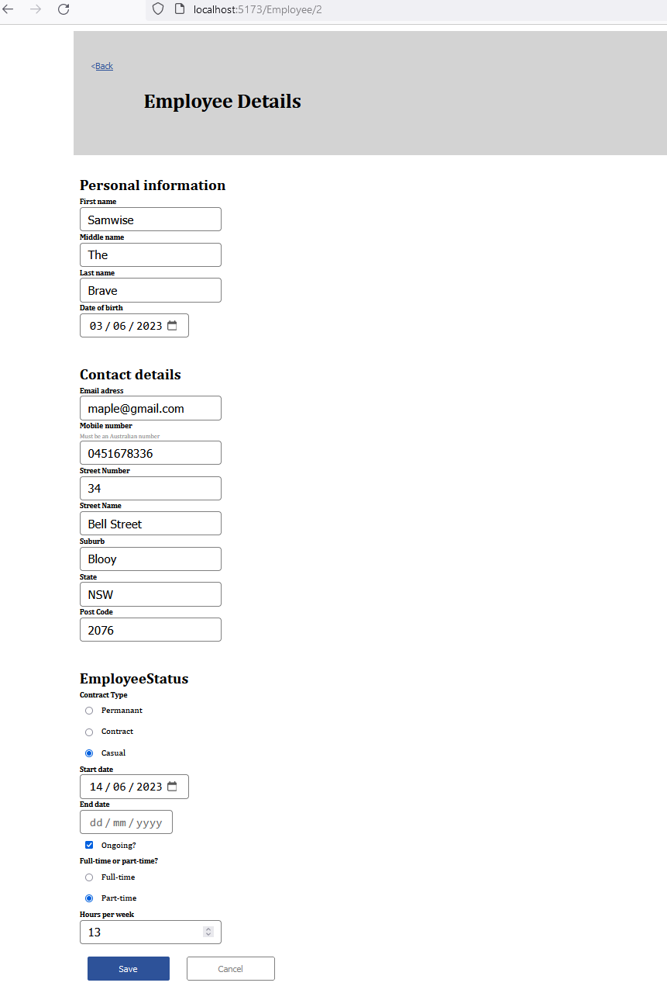
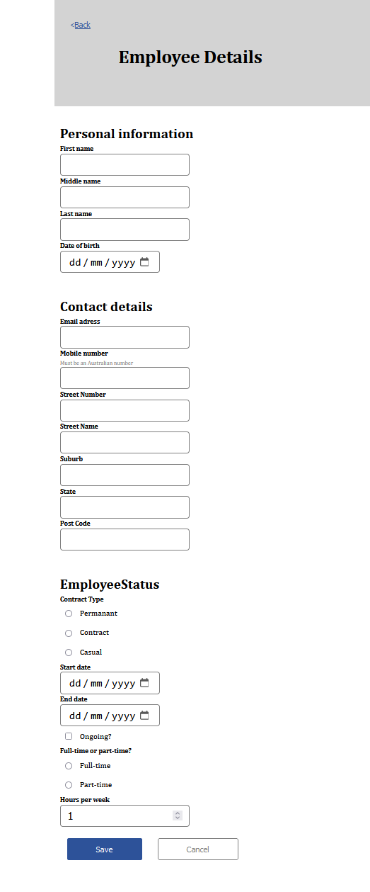
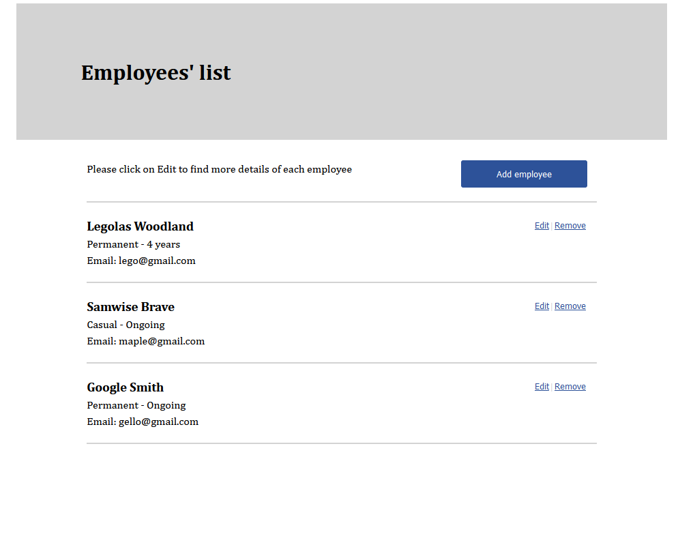

# Employee Creator FrontEnd (REACT TS)


## Demo & Snippets





---

## Requirements / Purpose

### MVP

-   Create a web application to create, list, modify and delete employees.
-   The application should consit of a Spring RESTful API(See repo linked at bottom) and A React Typescript frontend (this repo)
-   Use React Redux
-   Must be in TypeScript
-   Can utilise any opensource library
-   must have basic front end validation (e.g. required and max length)
-   Must be responsive
-   must be hosted using something such as Heroku, AWS, or Azure.

### Purpose of Project

The purpose of this project is to further develop my skills in REACT typescript utilising a wide array of React libraries including Redux, React Hook form, and tanstack query. Talking to a Spring and MySql backend in order to be able to create, see, and update employees in the employees database from the front end.

Additionally this allows for increased exposure to front end unit and E2E testing in REACT.

### Stack

The stack utilised is a Spring and MySQL backend with a React Type Script front end.
This was chosen in order to be able to both improve my skills using Spring (and Java in general) as well as continue to further improve in my ability in React and Typescript front ends. Additionally It will improve skills in E2E testing both from frontend and backend and testing in Java which i have less experience in than I do testing in JavaScript.

---

## Build Steps

To Do:

```console
cd employeeCreatorWebApp
npm run build
npm run preview
```

---

## Design Goals / Approach

To Do:

The Design Goals of this project was to build and develop a roubust component based front end utilising common and widley utilised tools such as redux, styled components, and react-hook-form in order for the project to be easily expanded with new features or used as reference for future projects.

I would have liked to approach this project in a more TDD way however due to introducing a number of librarys I have had previously no expereince utilisng as well as limited expereince in testing within React project I decided it would be more valueable to get the application running and working first before implementing tests. This has been an effective approach that has allowed me to rapidly develop the project to MVP before taking my time to learn and understand the principles of mocking for unit testing in React ts. Whilst difficult I was able to overcome the challenges faced here and provide a solid test suite that can be easily improved upon.

---

## Features

1. List Employee cards on home page displaying information about each employee and their contract length. 
2. Add new employees utilising the Add Employee form
3. Edit employees by clicking on the edit button on their card allowing you to utilise the same form pre-filled with all current employee information so you can change only exactly what you want!

---

## Known issues

To Do:

-   Remaining bugs, things that have been left unfixed
-   Features that are buggy / flimsy
-   E2E testing not implemented

---

## Future Goals

-   If given more time I would implement further front end testing allowing for a more robust test suite.

---

## Change logs

### 06/06/2023 - adding tests, fixing bugs

-   added tests for routing, employeeForm, and employeeList
-   Fixed bug due to conversions from local time to UTC causing dates to creep backwards
-   added feature allowing for page refresh on edit form page without going to standard blank form
-   Fixed ongoing date functionality to allow for employees to have contract end dates or ongoing

### 05/06/2023 - adding testing

-   testing library setup
-   begun creating front end tests

### 04/06/2023 - added redux store and yup form validation

-   added Yup form vaidation for the add and update form
-   added a redux store that allows the edit form to avoid having to talk to the DB and instead can just search the redux store by id
-   added method for adding ongoing employees (Still has some validation issues although this does not effect functionality but isn't good UX)

### 03/06/2023 - Styling

-   added styling for the edit and add employee form

### 02/06/2023 - Bug Fixes on Edit Employee Form, Styling

-   Fixed a bug where upon editing an employee only the first letter of the contract type and time would be sent to backend
-   added styling to list, header, and card componenets using styled components

### 01/06/2023 - Improvements to edit/add employee form

-   implemented new data structure from API
-   created autofill functionallity for edit forms
-   allow the same form component to both do edit and create employees depending on url vairable

### 31/05/2023 - Front end Setup, created employee list, and add employee form.

-   Set up REACT front end installing and configuring required libraries.
-   Created a list feature that retrieves all employees from backend and displays a list
    of employee cards.
-   created a create employee form that can be used to create a new employee that is then added to the backend.

---

## What did you struggle with?

-   Frontend mocks for specific functions. I was really stuggling to get the mocks working with TS but after much perserverance I got there.

---

## Licensing Details

To Do:

---

## Further details, related projects, reimplementations

-   See API at https://github.com/XelaRonnoc/employeeCreatorBackend
